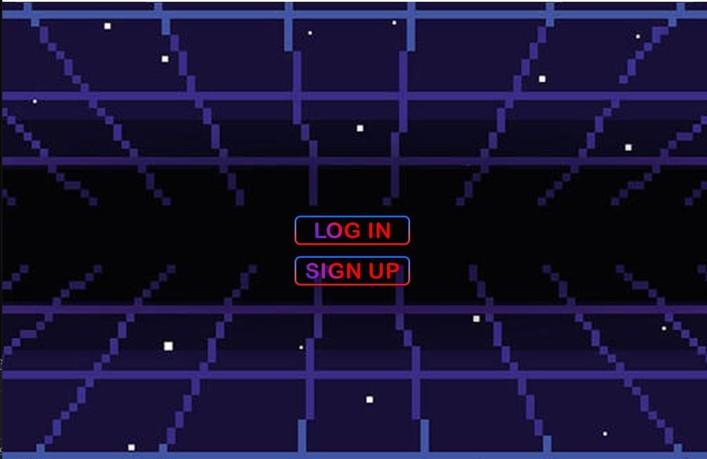
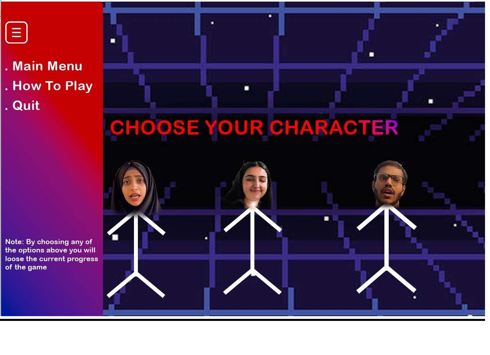
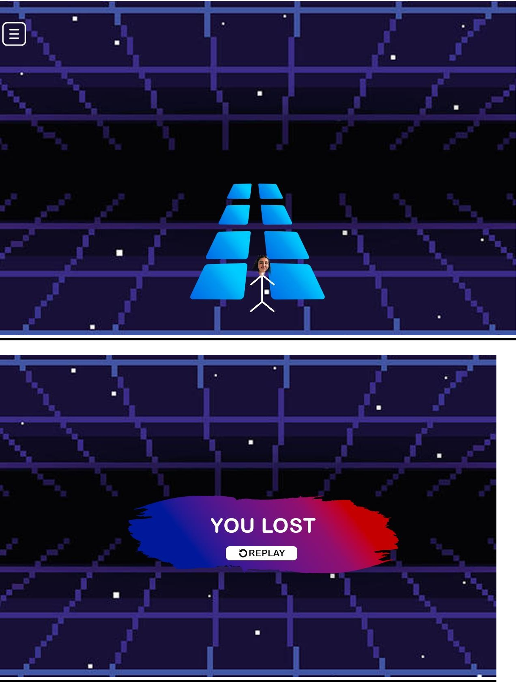
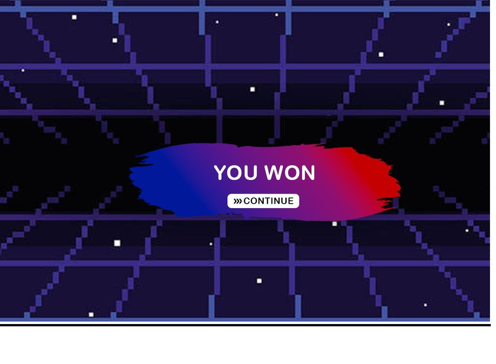

# 🎮 Junction Run (SFML Game)

A two-level adventure game developed in **C++** using the **SFML (Simple and Fast Multimedia Library)** framework.

The game combines two different gameplay styles:
- **Level 1:** Glass Bridge Challenge
- **Level 2:** Subway Surfers-inspired endless runner

Players can select their preferred character from the main menu before starting the game, making the gameplay more interactive and engaging.

---

## ✨ Features

- 🎮 Two unique game levels
- 👤 Character selection menu
- 🖥️ Interactive main menu
- 🚧 Obstacle avoidance gameplay
- 🌉 Glass bridge challenge
- 🎨 Graphics developed using SFML
- 📸 Gameplay screenshots included

---

## 🕹️ Gameplay

### Level 1 – Glass Bridge

Players must carefully choose between two glass panels.

- One glass panel is safe.
- The other breaks immediately.
- Choosing the wrong panel ends the game.

---

### Level 2 – Subway Surfers

After clearing Level 1, players enter a Subway Surfers-inspired environment.

The objective is to:

- Avoid obstacles
- Keep running
- Survive as long as possible

---

## 🛠️ Technologies Used

- C++
- SFML (Simple and Fast Multimedia Library)

---

## 📁 Project Structure

```
JUNCTION_RUN/
│
├── Characterselection.cpp
├── Level1backend.cpp
├── Level1frontend.cpp
├── Level2backend.cpp
├── Level2frontend.cpp
├── LoginPage.cpp
├── Loginsignup.cpp
├── Signup.cpp
├── source.cpp
│
└── Screenshots/
    ├── screenshot1.png
    ├── screenshot2.png
    ├── screenshot3.png
    └── ...
```

---

## 📸 Screenshots

## 📸 Screenshots

### Main Menu


---

### Character Selection


---

### Level 1 – Glass Bridge


---

### Level 2 – Subway Surfers


---

### Gameplay


---

## 🚀 How to Run

1. Install **SFML**.
2. Open the project in Visual Studio or any C++ IDE.
3. Configure the SFML libraries.
4. Build and run the project.

---

## 📚 Concepts Used

- Object-Oriented Programming (OOP)
- SFML Graphics Library
- Event Handling
- Collision Detection
- Game Loops
- Menu System
- Character Selection
- File Organization

---

